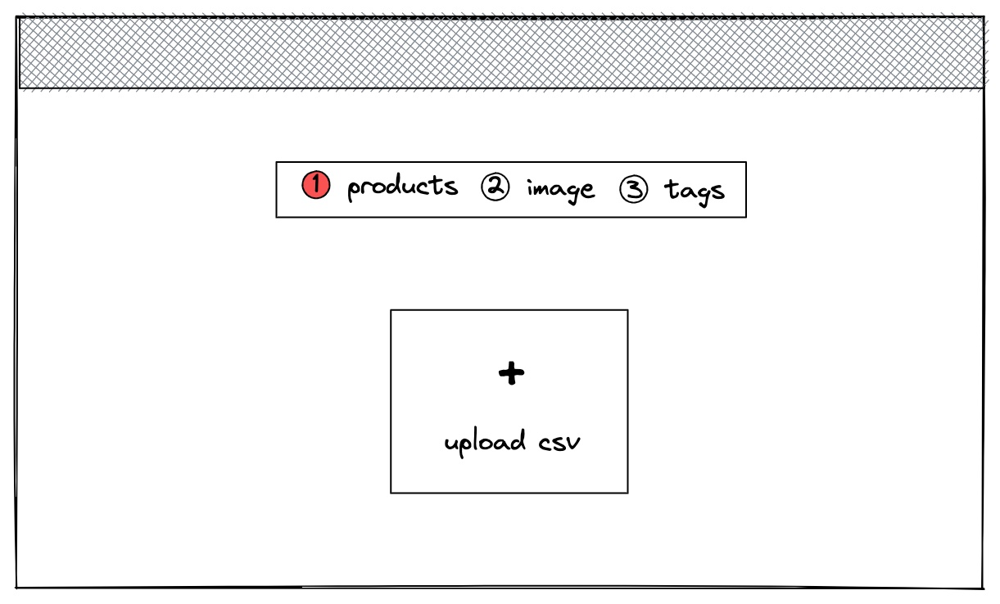
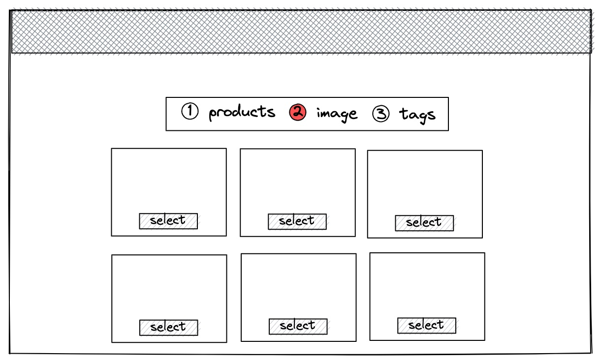
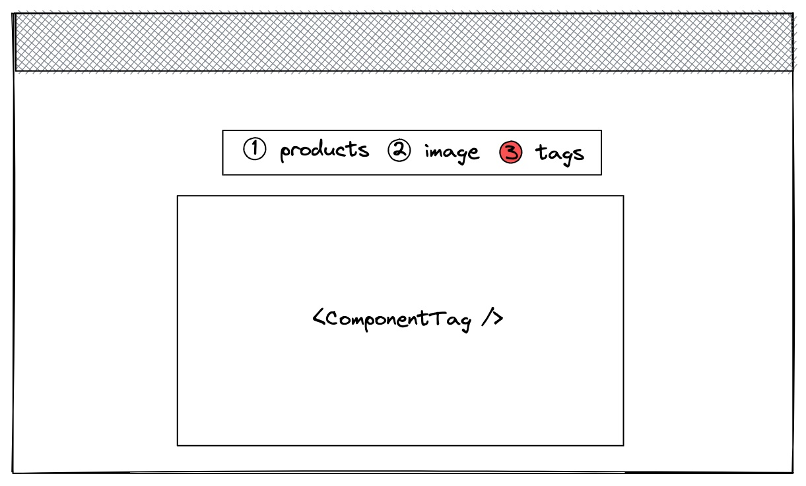

# Technical test

## Infos

- You must do your best to complete the test in **2 hours**.
- You must use **git** as version control system and publish your code in a **public github or gitlab repo** (and give us the link of the repository)
- You can add all packages and libraries you need to implement this technical test
- You can add all the development tools you want to improve your developer experience
- All provided mockup and images are only **sources of inspiration**
- You will **not** be evaluated for the UX and UI of the application but a nice design is always welcome

## Introduction

Pictures are static but contain a lot of information. The goal is to unleash pictures' potential and highlight information they contain.

The application we want to develop consists in allowing users to enrich pictures by pinning products on the picture.

We provide a project skeleton which contains:

- A `server` folder that contains all the server code:
  - an API endpoint that returns pictures informations as a JSON response (useful for **step 2**)
    - `GET /images`
- A `client` folder that contains all the client code
- An `assets` folder that contains a sample of products (`import.csv`) that will be used to pin (useful for **step 1**)

The frontend application is a single page with a multi steps module:

1. **Step 1** - import the products



2. **Step 2** - select a picture



3. **Step 3** - pin products on the picture



## Exercise 1 - import products

### Frontend

Create a page which starts the multi step module

**Step 1** allows the users to upload a csv file containing product information ([see csv specification](#csv-specification)) and validate to jump into **step 2**.

The result of the upload call will be used for the **step 3** of the multi-step module.

### Backend

Create an endpoint: `POST /upload` which accepts a POST request with `multipart/form-data` header containing a `.csv` file

Parse the csv file and return a JSON response which contains for each row (except header row)

- id
- name
- picture
  - url
  - width
  - height

Picture width and height are not given in the csv so you have to compute its dimensions on your own.

Response example:

```
[
  {
    id: "5f97fdce664d456a5a16e980",
    name: "my product 1",
    picture: {
      url:  "https://res.cloudinary.com/hubstairs/image/upload/v1620083358/production/5e2414ef.png",
      width: 640,
      height: 480
    }
  }
]
```

The order of the elements in this array does not need to be the same as in the CSV file.

You should handle errors and return a response with an error http code. You can also put an error message in the response body.

## Exercise 2 - pin in picture

**Step 2** lists all the pictures provided by the endpoint `/images`.

This endpoint returns a JSON which is an array of `{id, picture}` object

Response example:

```
[
 {
    id: "5f97fdce664d456a5a16e980",
    picture: {
      url: "https://res.cloudinary.com/hubstairs/image/upload/v1620083358/production/5e2414ef.png",
      width: 2048,
      height: 1536
    }
  }
]
```

When selecting a picture, jump into **step 3**.

**Step 3** displays the selected picture in the center of the page.

Clicking on the picture at position `{x, y}` will open a select that list the products (cf. exercise 1).

Selecting a product will put a pin with the product's picture at the `{x, y}` position. The product’s picture will be 50px width long.

Clicking on a product’s picture will **remove** the pin.

**Several** pins can be present on the picture at the same time.

This page is **responsive**, this means that if the page is resized, the picture keeps it’s proportion and pins stay relatively at the same position.

Result example:


Add an “Export” button to print in console a json containing the:

- picture id
- pins
  - position
    - x
    - y
  - product id pinned

> If for some reason the exercise 1 has been skipped, you can use the provided mocks (path to mock) to realise the exercise 2.

## CSV specification

The csv file always contains a header row: `id;name;url`

Then for each row it contains:

- an id: hexadecimal string; required
- a name: max length 300 characters; required
- a picture url: url; required
